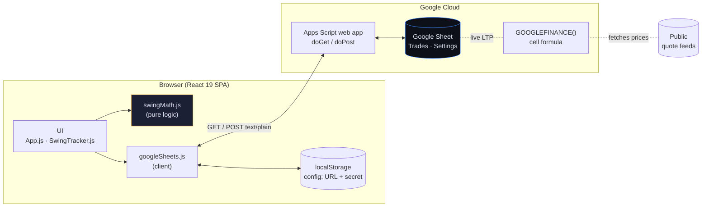
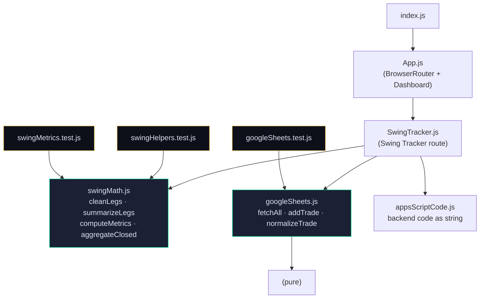
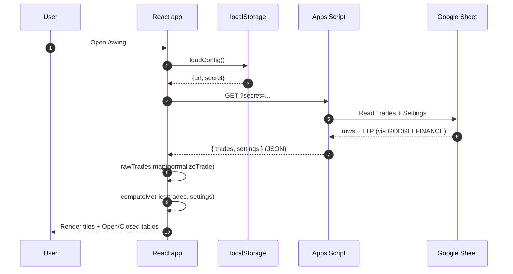
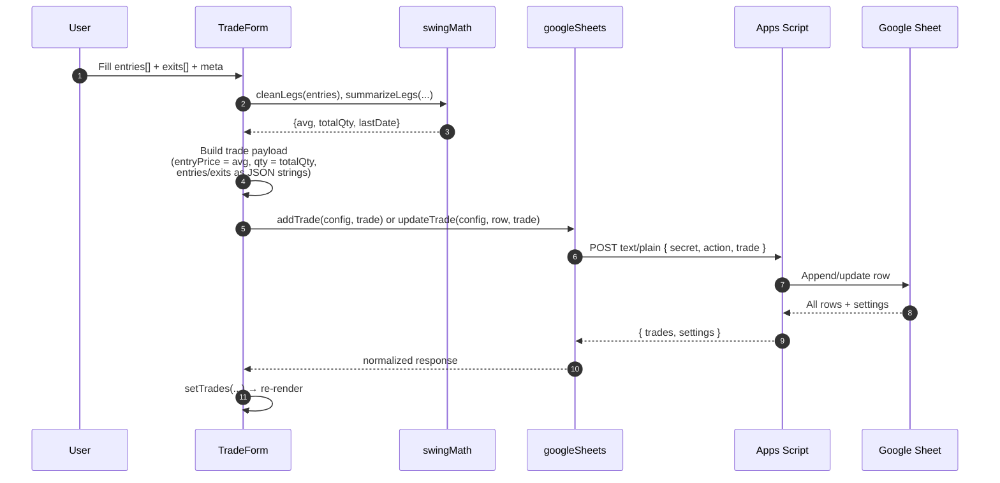
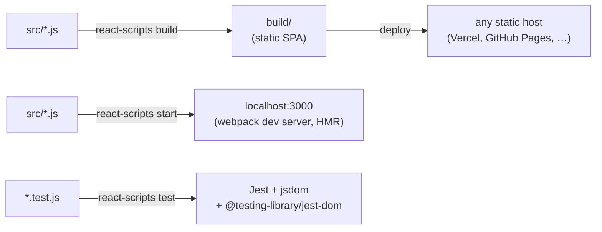

# TradeScope — Architecture

> Companion to [CLAUDE.md](CLAUDE.md). This file holds the diagrams. Read CLAUDE.md first for context, conventions, and testing rules.

---

## System overview



**Key points**

- The "backend" is Google Apps Script + a Google Sheet. No server, no DB.
- POSTs use `Content-Type: text/plain` to dodge CORS preflight (Apps Script web apps can't return custom CORS headers).
- Live prices are pulled by the **sheet**, not the app — the `LTP` column is `=GOOGLEFINANCE(B2,"price")`.
- Authentication is a shared secret stored in `localStorage` and sent with every request.

---

## Module dependency graph



**Why this shape:** `swingMath.js` is intentionally dependency-free (no React, no router, no DOM). That's what makes it cheap to unit-test under CRA's Jest, which can't transform `react-router-dom@7`'s ESM exports. Component tests would need a working router mock — pure-function tests don't.

---

## Read path — loading the dashboard



If the user has no config saved, the SetupScreen renders instead of triggering a fetch.

---

## Write path — saving a trade (single OR multi-leg)



**Why text/plain on POST:** Apps Script's web-app endpoint can't return `Access-Control-Allow-Headers`. Sending JSON would trigger a preflight OPTIONS request and fail. `text/plain` skips preflight; the Apps Script backend parses `JSON.parse(e.postData.contents)` itself.

---

## Realized P&L computation (the rule that bit us)

```mermaid
flowchart TD
    Start([for each trade]) --> HasLegs{exits[].length > 0?}
    HasLegs -- yes --> SumLegs["sum over exit legs:<br/>(legPrice − entryAvg) × legQty"]
    HasLegs -- no --> IsClosed{status == 'Closed'<br/>AND exitPrice > 0?}
    IsClosed -- yes --> Flat["legacy fallback:<br/>(exitPrice − entryPrice) × qty"]
    IsClosed -- no --> Skip["skip<br/>(open, no exits booked)"]
    SumLegs --> Add[realizedPnl += pnl]
    Flat --> Add
    Add --> Next([next trade])
    Skip --> Next

    style SumLegs fill:#0d1018,color:#dde2f0,stroke:#00d68f
    style Flat fill:#0d1018,color:#dde2f0,stroke:#4488ff
    style Skip fill:#0d1018,color:#dde2f0,stroke:#3a4060
```

**Why this branching exists:**

- **Leg path** is correct even when `exits.totalQty != entries.totalQty` (partial close marked Closed). The old `(exitPrice − entryPrice) × qty` formula would *double-count* in that case because `qty` is stored as **entry total**, not exit total.
- **Legacy path** is the fallback for sheet rows created before the multi-leg JSON columns existed. They still need to load.
- **Skip path** prevents NaN propagation for fresh open trades with no exits booked.

Win-rate is a **separate** loop over `closed` only — partial exits on still-Open trades contribute to realized P&L but not to win-rate.

---

## Sheet schema

The sheet has two tabs:

### `Trades`

| Column | Type | Purpose |
|---|---|---|
| Date | date | Earliest entry-leg date |
| Symbol | string | Ticker (uppercase) |
| Entry Price | number | Weighted-avg entry price (legacy / display) |
| Stop Loss | number | |
| Target | number | Legacy, unused in current UI |
| Qty | number | Total entry qty (legacy / display) |
| Status | string | "Open" or "Closed" |
| Exit Price | number | Weighted-avg exit price (legacy / display) |
| Exit Date | date | Last exit-leg date |
| Notes | string | |
| Market Condition | string | enum |
| Chart Link | url | |
| Mistakes | string | enum-ish, comma-separated |
| LTP | formula | `=IFERROR(GOOGLEFINANCE(B2,"price"),"")` |
| **Entries** | JSON string | Canonical multi-leg array `[{price,qty,date},…]` |
| **Exits** | JSON string | Canonical multi-leg array `[{price,qty,date},…]` |

The "legacy / display" columns (Entry Price, Qty, Exit Price, Exit Date) are kept readable for humans browsing the sheet. The app reads `Entries`/`Exits` JSON when present and falls back to the flat columns otherwise.

### `Settings`

Single row:

| Column | Type |
|---|---|
| totalCapital | number |
| riskPerTradePct | number |

---

## Build & runtime



**Stack pinned versions** (see `package.json`):

- React 19.2.4
- react-router-dom 7.14.2 *(ESM-only — keeps Jest from importing components)*
- recharts 3.8.0
- xlsx 0.18.5
- react-scripts 5.0.1 *(legacy CRA tooling — Jest config can't be customized cleanly)*

---

## Adding a new metric or aggregation — checklist

1. Write the pure function in `swingMath.js`. No React, no router, no DOM.
2. Add it to `computeMetrics` return value (if it's a top-level dashboard metric).
3. Add a `describe` block in `swingMetrics.test.js` covering:
   - empty input → no NaN, no divide-by-zero
   - happy path with handcrafted numbers
   - partial-exit-on-Open case
   - legacy-row (no `entries[]`/`exits[]`) case
4. Render the new tile in the JSX of `SwingTracker.js`. Reuse `<StatCard>`.
5. Update the `.stat-grid` CSS column count + responsive breakpoints if needed.
6. Run `npm test -- --watchAll=false`. Must pass.
7. Verify visually in the preview at all four breakpoints.
8. **Update `CLAUDE.md` and this file** if the new metric introduces a new invariant or changes data flow.

---

## Adding a new field to the trade shape — checklist

1. Add the column header in `appsScriptCode.js` (`SHEET_HEADERS`).
2. Re-deploy the Apps Script web app (manual step in Google).
3. Add the field to `normalizeTrade` in `googleSheets.js` (with sane default).
4. Add a test case in `googleSheets.test.js` for the new field's coercion.
5. Wire it through the form in `SwingTracker.js → TradeForm`.
6. Add it to `handleSave`'s `trade` payload.
7. If the field affects metrics, update `swingMath.js` and `swingMetrics.test.js`.
8. Run all tests. Must pass.
9. Smoke-test against a staging sheet (Apps Script changes are not unit-tested).

---

## Future improvements (not yet built)

- **Playwright E2E** — would have caught the Safari `<select>` rendering bug on the first commit. See CLAUDE.md → "What's NOT covered by automated tests".
- **MSW** for component tests — mock the Apps Script backend so we can render `SwingTracker` end-to-end in Jest. Requires solving the `react-router-dom` resolution issue first.
- **husky pre-commit hook** — run `npm test` before allowing a commit. Currently the testing rule is human/AI discipline only.
- **Backend integration tests** — `appsScriptCode.js` is currently un-testable from the JS side. A clasp-based test harness against a staging sheet would help.
